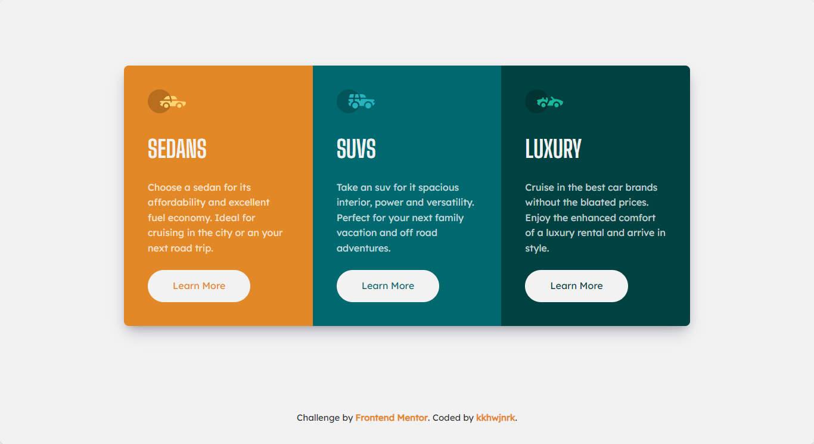

# 3 Card Preview Component 📄🃏

👋 Hello! This project is my submission for the 3 Card Preview Component challenge from Frontend Mentor. In this challenge, I created a responsive component using HTML and SCSS. I took a mobile-first approach to ensure the design is responsive across multiple screen sizes.

### Design 🎨

The profile card component showcases a background image and a content section that displays the user's profile image, name, age, and location. The component also includes a social statistics section showcasing the user's follower count, number of likes, and photos. For an example, please visit the [Mobile](./design/mobile-design.jpg) and [Desktop design](./design/desktop-design.jpg).

### Live Demo 🚀

You can view the live demo of the project [here](https://column-card.kkhwjnrk.vercel.app/).

### Credits 💻

This project was completed as part of the [Frontend Mentor](https://www.frontendmentor.io) challenge. Check out their website for more projects to help improve your frontend development skills.

### About Me 🌟

If you'd like to check out my profile on Frontend Mentor, you can do so [here](https://www.frontendmentor.io/profile/kkhwjnrk).

